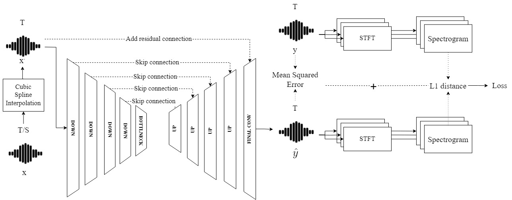
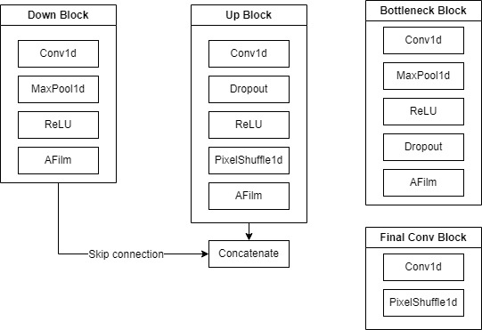
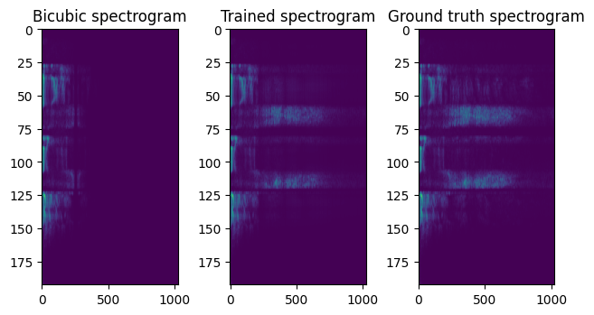

# Set up the python environment 

```shell
conda create -n audiounet python=3.7
conda activate audiounet
# make sure that the pytorch cuda is consistent with the system cuda
# pytorch version must >= 1.9.0
conda install pytorch==1.12.1 torchvision==0.13.1 torchaudio==0.12.1 cudatoolkit=11.3 -c pytorch
pip install -r requirements.txt
# this is for using ipynb
conda install -c anaconda ipykernel
python -m ipykernel install --user --name=audiounet
```
# Prepare Dataset
Make sure your dataset is in data folder
Make sure you have enough disk space and bandwidth (the dataset is over 18G, uncompressed).
You need to type:
```shell
python prepare_vctk.py
```
The processed dataset will be saved in data folder

# Training
### Type the following commands to train an AudioUNet
```shell
# change directory to the folder AudioUnet
cd AudioUnet
# run train.py and --exp means the name of the folder of the results and the trained model name --num_epochs is # of epochs you want to train
python train.py --exp $(name) --num_epochs $(#epochs you want to train)
```

# Results after training
1. In results/$(name), you can see the loss curve, LSD curve and PSNR curve which is named after Loss.jpg, Avg LSD Curve.jpg and Avg PSNR Curve.jpg
2. In ckpts/$(name).pth is your trained model after training

# Run pretrained model (Testing)
Execute test.ipynb and change your pretrained model to the correct path (e.g. ./ckpts/$(name)/pth)

# Model Architecture

# Model Blocks

# Results after reconstruction
